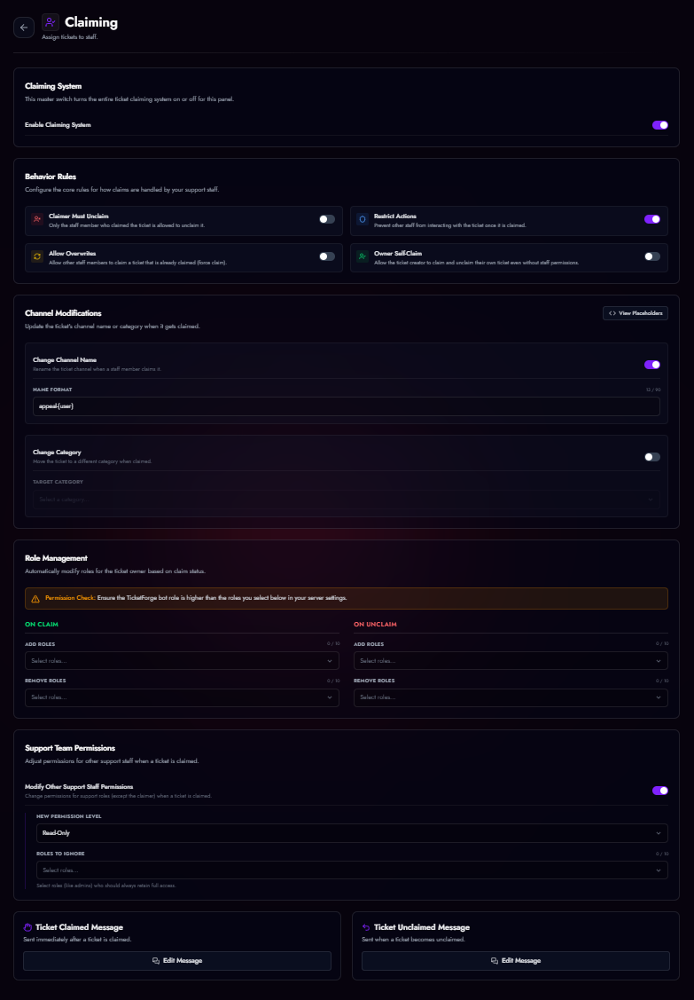

# Ticket Claiming System

The Claiming System allows a staff member to take ownership of a ticket, preventing multiple moderators from responding to the same user simultaneously.

<figure markdown>
  { loading=lazy }
  <figcaption>Claim settings.</figcaption>
</figure>

## Setup
Go to **Panel Editor > Claiming** to enable this feature.

## Behavior Rules

*   **Restrict Actions:** If enabled, *only* the staff member who claimed the ticket (and the user) can type or use buttons. Other staff are locked out.
*   **Claimer Must Unclaim:** Prevents other staff from "stealing" a ticket. Only the original claimer can release it.
*   **Zero Permissions:** You can configure the bot to **Hide** the channel from other staff members once it is claimed.

## Visual Indicators
*   **Channel Rename:** Change the channel name to `claimed-{user}`.
*   **Category Move:** Move the ticket to a specific "In Progress" category.