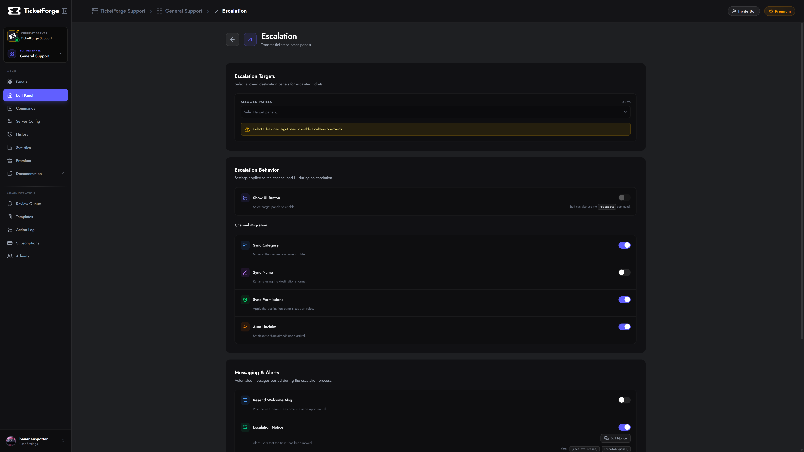

# Ticket Escalation

Escalation allows you to move an active ticket from one panel to another (e.g., from "General Support" to "Billing" or "High Priority"). This ensures tickets reach the right department without forcing the user to open a new request.

<figure markdown>
  { loading=lazy }
  <figcaption>Escalation configuration settings.</figcaption>
</figure>

## How it Works

When a ticket is escalated:
1.  The ticket adopts the configuration of the **Target Panel**.
2.  Permissions are updated to match the new panel's Support Roles.
3.  The ticket can be physically moved to a new Category.
4.  Staff can be automatically unclaimed to allow the new team to take over.

## Configuration

Navigate to **Panel Editor > Escalation**.

### 1. Allowed Targets
Select which panels this current panel can escalate *to*. 
*   *Example:* A "Triage" panel might be allowed to escalate to "Billing", "Tech Support", and "Management".

### 2. Escalation Actions
Control what happens during the transfer:

| Setting | Description |
| :--- | :--- |
| **Update Category** | Moves the ticket channel to the category defined in the Target Panel. |
| **Update Permissions** | Syncs channel permissions to the Target Panel's support roles (e.g., hiding it from Moderators and showing it to Admins). |
| **Update Name** | Renames the channel based on the Target Panel's naming scheme. |
| **Auto Unclaim** | Removes the current claimer, releasing the ticket for the new department to claim. |
| **Send Transfer Message** | Posts a system message indicating the ticket has been transferred. |
| **Send New Panel Message** | Posts the "Welcome Message" of the target panel, ensuring the user sees the correct greeting/instructions for the new department. |

## How to Escalate
Staff members can escalate a ticket in two ways:

1.  **Escalation Button:** If `Show Escalate Button` is enabled in settings, a button appears in the ticket interface.
2.  **Slash Command:** Using `/escalate` (if available) to select the target panel from a dropdown.