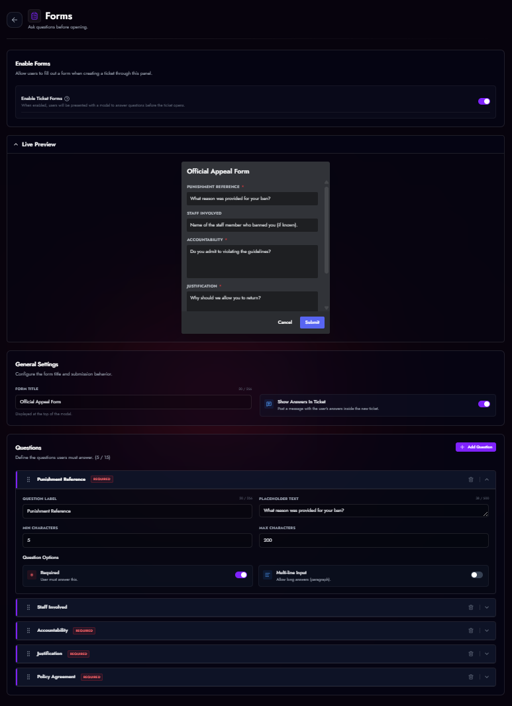

# Custom Forms (Modals)

Instead of creating a ticket immediately, you can require users to fill out a form (Modal) first. This helps your team get context before starting the conversation.

<figure markdown>
  { loading=lazy }
  <figcaption>Form editor.</figcaption>
</figure>

## Configuration

1.  Navigate to **Panel Editor > Forms**.
2.  Toggle **Enable Ticket Forms**.
3.  Click **Add Question**.

### Question Types

| Setting | Description |
| :--- | :--- |
| **Label** | The question text (e.g., "What is your Minecraft Username?"). |
| **Placeholder** | Grey text inside the input box to guide the user. |
| **Required** | Users cannot submit the form without answering this. |
| **Multi-line** | Switches from a small input box to a large text area (Paragraph). |
| **Min/Max Length** | Enforce character limits for answers. |

### Results
When a user submits the form:
1.  The ticket is created.
2.  The bot posts an embed containing all their answers.
3.  (Optional) Staff can edit these answers later if needed.