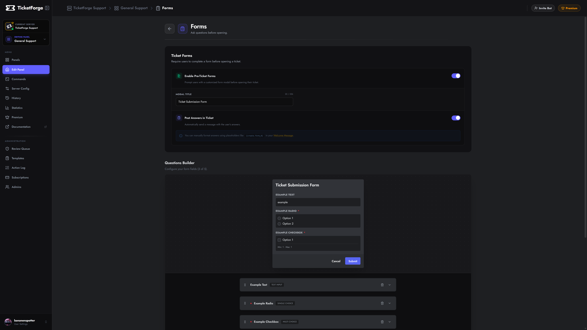

# Custom Forms (Modals)

Instead of creating a ticket immediately, you can require users to fill out a form (Modal) first. This helps your team get context before starting the conversation.

<figure markdown>
  { loading=lazy }
  <figcaption>Form editor.</figcaption>
</figure>

## Configuration

1.  Navigate to **Panel Editor > Forms**.
2.  Toggle **Enable Ticket Forms**.
3.  Click **Add Question**.

### Question Types

When creating a question, you can choose the **Response Type** (`Text Input`, `Single Choice` for radio buttons, or `Multiple Choice` for checkboxes). Depending on the type you select, different settings will be available:

| Setting | Applicable To | Description |
| :--- | :--- | :--- |
| **Question Label** | All | The question text (e.g., "What is your Minecraft Username?"). |
| **Required Response** | All | Users cannot submit the form without answering this field. |
| **Available Options** | Single & Multiple Choice | Define the choices users can pick from. You can add a main label and an optional description for each choice. |
| **Min/Max Selections** | Multiple Choice | Enforce how many checkboxes a user must or can select. |
| **Placeholder** | Text Input | Grey text inside the input box to guide the user. |
| **Multi-line** | Text Input | Switches from a small input box to a large text area (Paragraph). |
| **Min/Max Length** | Text Input | Enforce character limits for answers. |

### Results
When a user submits the form:
1.  The ticket is created.
2.  The bot posts an embed containing all their answers.
3.  (Optional) Staff can edit these answers later if needed.