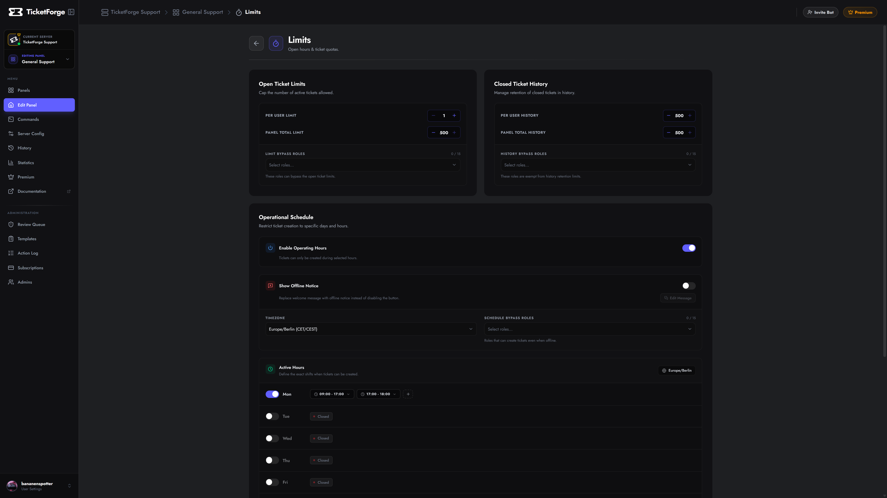

# Limits & Schedules

Control the flow of tickets to prevent spam and burnout.

<figure markdown>
  { loading=lazy }
  <figcaption>Limit and Schedule settings.</figcaption>
</figure>

## Ticket Limits
Prevent users from spamming your support team.

*   **Per User Limit (open):** Max open tickets a single user can have (Default: 1).
*   **Per User Limit (closed):** Max closed tickets a single user can have (Default: 500).
*   **Bypass Roles:** Select roles (like VIPs or Boosters) that ignore these limits.

## Operational Schedule
Define your support hours. Users cannot open tickets outside these times.

1.  **Timezone:** Select your team's timezone (e.g., `America/New_York` or `UTC`).
2.  **Weekly Grid:** Click blocks to toggle hours Open/Closed.
3.  **Action:**
    *   *Disable Creation:* The button stops working.
    *   *Notification:* The button works, but sends a custom "We are closed" message instead of the standard welcome.