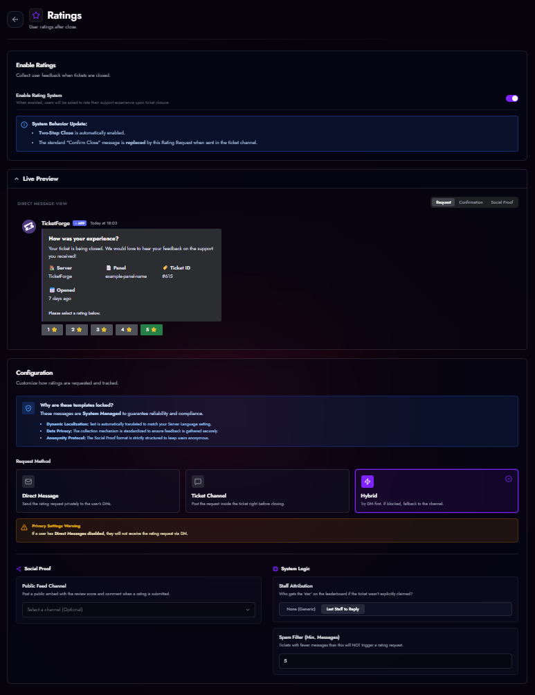

# Staff Rating System (CSAT)

Gather feedback on your support team's performance.

<figure markdown>
  { loading=lazy }
  <figcaption>Rating settings.</figcaption>
</figure>

## How it works
1.  A staff member closes the ticket.
2.  The bot sends a **Rating Request** (Embed with 1-5 Star buttons).
3.  The user clicks a star rating.

## Configuration
*   **Delivery Method:**
    *   *Channel:* Posts the request in the ticket before deletion.
    *   *DM:* Sends the request to the user's Direct Messages.
    *   *Hybrid:* Tries DM first, falls back to Channel if DMs are closed.
*   **Public Feed:** Select a channel to publicly post positive reviews as social proof.