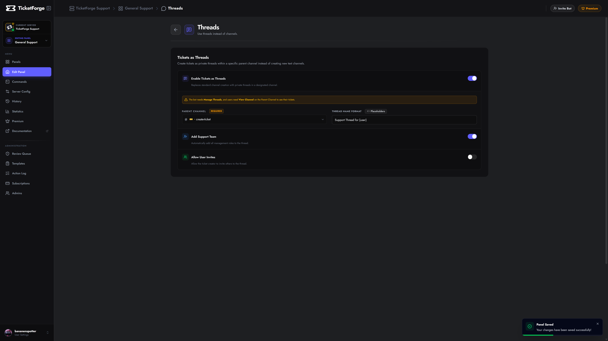

# Tickets as Threads

By default, TicketForge creates a new **Text Channel** for every ticket. The **Tickets as Threads** feature changes this behavior to create **Private Threads** inside a single parent channel.

<figure markdown>
  { loading=lazy }
  <figcaption>Ticket as thread settings.</figcaption>
</figure>

## Why use Threads?
*   **Cleaner Sidebar:** Prevents your server sidebar from getting cluttered with 50+ open ticket channels.
*   **Bypass Limits:** Discord has a limit of 500 channels per server. Threads do not count towards this limit, allowing for thousands of tickets.
*   **Performance:** Faster creation times on large servers.

## Configuration

1.  Navigate to **Panel Editor > Threads**.
2.  Enable **Tickets as Threads**.
3.  **Parent Channel:** Select the text channel where the threads will live.

## Options
| Setting | Description |
| :--- | :--- |
| **Thread Name** | Format: `ticket-{count}` or `help-{user}`. |
| **Add Support Team** | Automatically adds the configured support roles to the thread so they can view it. |
| **Allow User Invites** | Allows the ticket creator to invite other users to the thread via `@mention`. |

!!! warning "Category Settings"
    When Thread Mode is enabled, **Category settings are disabled**. Threads always reside in their parent channel and cannot be "moved" to a category.