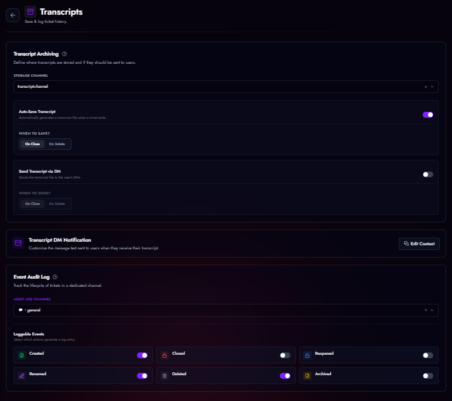

# Transcripts & Logging

TicketForge ensures you never lose the context of a conversation. Transcripts are permanent HTML files containing the full chat history.

<figure markdown>
  { loading=lazy }
  <figcaption>Transcripts and logging settings.</figcaption>
</figure>

## Transcript Archiving

Navigate to **Panel Editor > Transcripts**.

### Configuration
1.  **Storage Channel:** Select a private text channel where the bot will post transcript files.
2.  **Auto-Save:** Automatically generate a transcript when a ticket is closed.
    *   *Trigger:* Choose to save on **Close** (archive state) or **Delete** (permanent removal).
3.  **DM Transcript:** Send the HTML file directly to the user who opened the ticket.
    *   *Note:* This will fail if the user has DMs disabled.

## Event Audit Log
Separate from the chat history, the **Audit Log** tracks lifecycle events.

### Logged Events
You can toggle specific events to reduce spam:
*   **Created / Closed / Reopened**
*   **Renamed**
*   **Deleted**
*   **Archived**

Each log entry includes the **Executor** (who did it), the **Target** (ticket owner), and a timestamp.