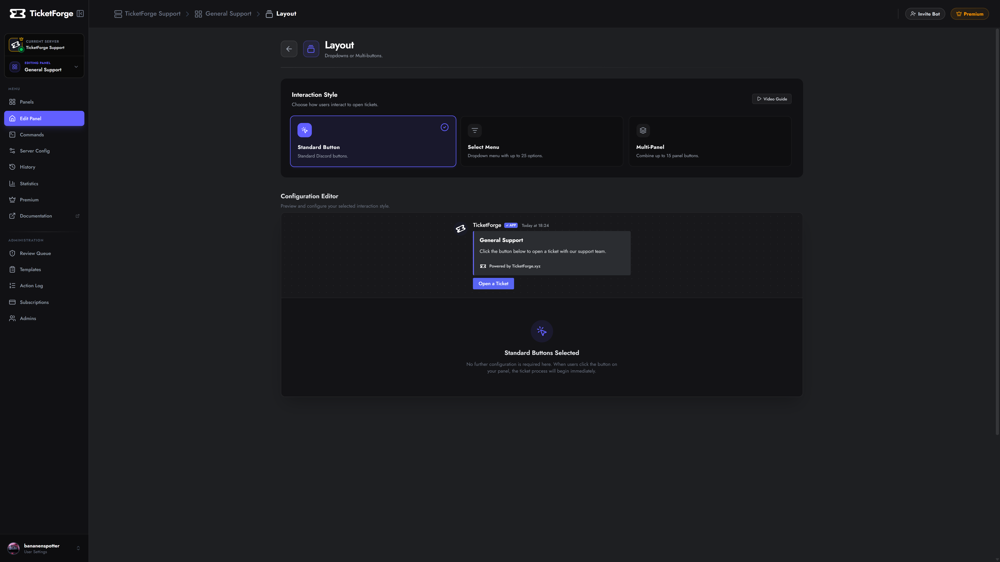
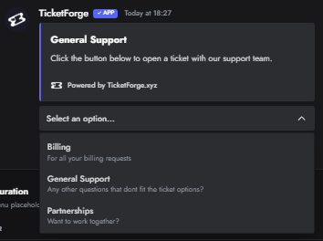
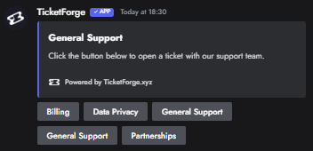

# Interaction Styles (Layout)

TicketForge offers three distinct interaction styles for your panels, allowing you to optimize for space or visual appeal.

<figure markdown>
  { loading=lazy }
  <figcaption>Layout settings.</figcaption>
</figure>

## Video Tutorial

Watch our video guide below to learn step-by-step how to set up both multi-panel buttons and select style (dropdown) layouts:

<iframe width="560" height="315" src="https://www.youtube.com/embed/3nqu6CQ8AyQ" title="YouTube video player" frameborder="0" allow="accelerometer; autoplay; clipboard-write; encrypted-media; gyroscope; picture-in-picture; web-share" allowfullscreen></iframe>

*(If the embedded video above doesn't load, you can also [watch the tutorial on YouTube](https://www.youtube.com/watch?v=3nqu6CQ8AyQ).)*

---

## 1. Single Button
The standard panel with a single button. This is the default style and is best for simple, straightforward setups where users only need one option to click.

---

## 2. Select Menu (Dropdown)
Best for panels with many categories (e.g., "Tech Support", "Billing", "Report Player", "Bug Report").

*   **Capacity:** Up to 25 options in a single menu.
*   **Descriptions:** Each option can have a secondary text line for context.
*   **Emojis:** Supported for every option.
*   **Logic:** Each option in the dropdown triggers a *different* panel configuration behind the scenes.

<figure markdown>
  { loading=lazy }
  <figcaption>Panel with dropdown selection.</figcaption>
</figure>

---

## 3. Multi-Panel
A powerful layout that combines buttons from **multiple different panels** into a single message. Best for panels with 2-5 options.

*   **How it works:** You create a "Master Panel" and attach other panels to it.
*   **Visual:** The bot displays the buttons from all attached panels in a grid under one embed.
*   **Benefit:** Allows you to have a "General Support" button and an "Apply for Staff" button in the same message, even though they have completely different logic/roles behind them.

<figure markdown>
  { loading=lazy }
  <figcaption>Panel with multiple buttons.</figcaption>
</figure>

### Configurable Buttons
In **Panel Editor > Buttons**, you can customize the following system buttons for any of your panels:

| Button | Default Label | Function |
| :--- | :--- | :--- |
| **Create Ticket** | `Open Ticket` | Opens a new ticket for the user. |
| **Close Ticket** | `Close` | Archives the ticket (or triggers confirmation). |
| **Claim Ticket** | `Claim` | Assigns the ticket to the clicker. |
| **Transcript** | `Transcript` | Generates a log file of the chat. |
| **Delete** | `Delete` | Permanently deletes the channel. |
| **Re-Open** | `Re-Open` | Moves a closed ticket back to the open category. |
| **Confirm Close** | `Confirm` | The "Yes" button in the close confirmation prompt. |
| **Cancel Close** | `Cancel` | The "No" button in the close confirmation prompt. |

*   **Customization:** You can change the **Label** and **Color** (Blurple, Grey, Green, Red), and **Role Requirements** for each button.