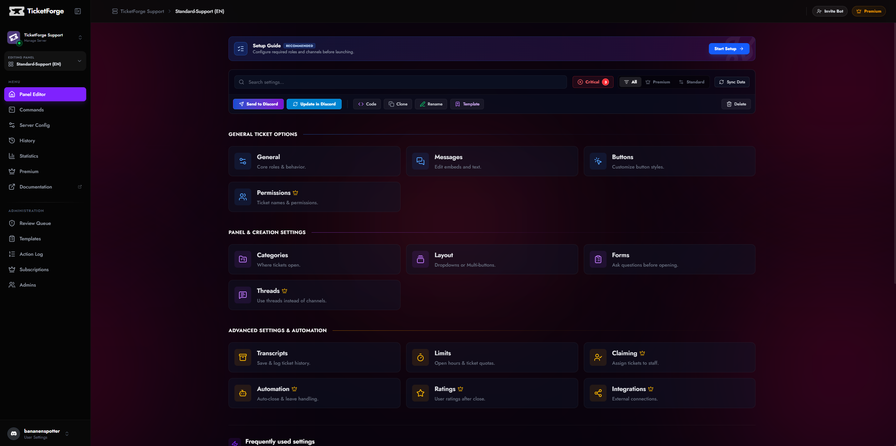
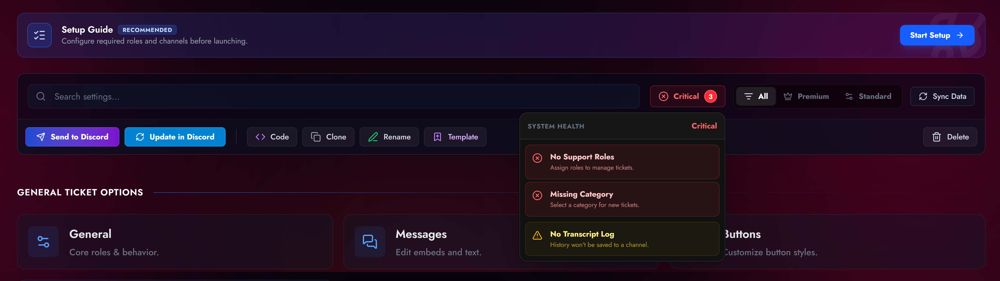
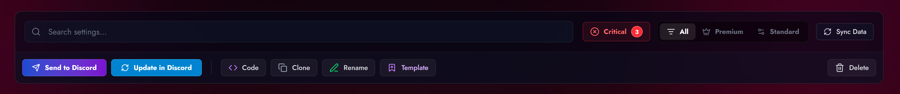

# The Panel Editor

The **Panel Editor** is your workspace for building support workflows. It features a real-time health check system, auto-save protection, and granular control over every aspect of your ticket system.

<figure markdown>
  { loading=lazy }
  <figcaption>The panel eidtor screen.</figcaption>
</figure>

## Editor Navigation

The sidebar navigation is divided into three logical groups to help you find settings quickly:

### 1. General Ticket Options
Core settings that define how the ticket behaves once created.

*   **General** — Basic behavior like "Two-Step Close" and management roles.
*   **Messages** — The embed builder for Welcome messages, Panel messages, and DMs.
*   **Buttons** — Customize the color, label, and emoji of interaction buttons.
*   **Permissions** *(Premium)* — Configure channel visibility and role overrides.

### 2. Panel Creation Settings
Settings that affect how the user *starts* the interaction.

*   **Categories** — Define which Discord Category the ticket channel appears in.
*   **Layout** — Switch between Standard Buttons, Select Menus (Dropdowns), or Multi-Panel layouts.
*   **Forms** — Create modal questionnaires that users must fill out before a ticket opens.
*   **Threads** *(Premium)* — Toggle "Tickets as Threads" mode to keep your channel list clean.

### 3. Advanced Settings & Automation
Powerful tools for large communities and professional support teams.

*   **Transcripts** — Configure HTML log saving and audit logging channels.
*   **Limits** — Set per-user ticket caps and operational hours (Schedules).
*   **Claiming** — Enable the "Claim Ticket" system for staff ownership.
*   **Automation** — Auto-close on user leave and automated DM notifications.
*   **Ratings** — Enable the CSAT (5-star) feedback system.
*   **Integrations** — Connect with external tools (e.g., Steam - Coming Soon).

---

## Editor Interface Features

### Health Check (Status Badge)
In the top right, you will see a live **Health Status** badge.
*   **🟢 Healthy:** The panel is ready to use.
*   **🟡 Warning:** Non-critical issues found (e.g., "No Transcript Channel selected").
*   **🔴 Critical:** Configuration errors that prevent the panel from working (e.g., "No Support Roles selected").

**Click the badge** to see a detailed checklist and "Fix" shortcuts.

<figure markdown>
  { loading=lazy }
  <figcaption>See the health of your panel.</figcaption>
</figure>

### Save System
The editor tracks your changes locally. If you modify a setting, a **Save Bar** appears at the bottom of the screen.
*   **Discard:** Reverts all unsaved changes to the last stable version.
*   **Save Changes:** Pushes your configuration to the live bot.

<figure markdown>
  { loading=lazy }
  <figcaption>The savebar.</figcaption>
</figure>

!!! note "Idle Protection"
    If you leave the editor open without saving, an "Idle" modal will appear to prevent data loss.

---

## Action Menu

Located in the top toolbar (or under the "More" menu on mobile), these tools allow you to manage the panel itself.

<figure markdown>
  { loading=lazy }
  <figcaption>The actionbar on the paneleditor page.</figcaption>
</figure>

| Action | Icon | Description |
| :--- | :--- | :--- |
| **Send to Discord** | :material-send: | Posts the configured Panel Message to a text channel of your choice. |
| **Update in Discord** | :material-refresh: | Updates the content/embeds of an *existing* panel message without deleting/reposting it. Requires the Message Link. |
| **Get Code** | :material-xml: | Generates a shareable code (`XXXX-XXXX-XXXX`) to copy this configuration to another server. |
| **Clone** | :material-content-copy: | Creates an exact duplicate of this panel within the same server. Useful for A/B testing. |
| **Template** | :material-bookmark-plus-outline: | Saves this configuration as a Template (Public or Private) for future use. |
| **Rename** | :material-pencil: | Change the internal name of the panel (e.g., "Support" -> "Billing"). |
| **Delete** | :material-delete: | Permanently removes the panel configuration. **This action cannot be undone.** |