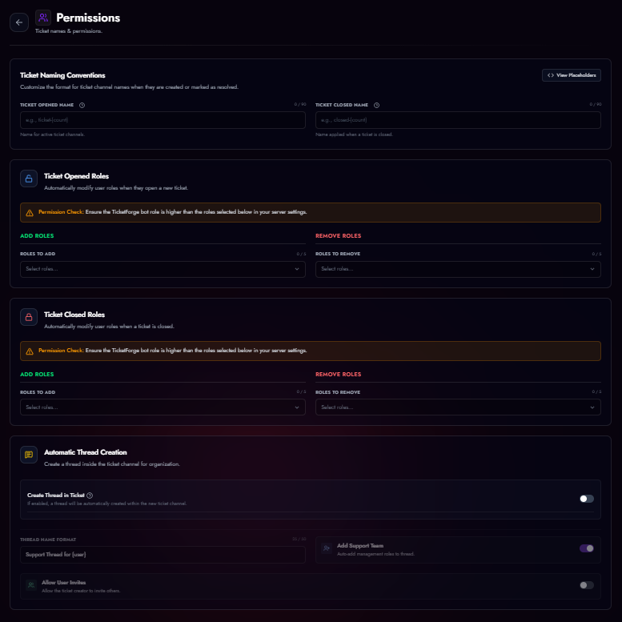

# Ticket Settings

Control the fundamental behavior of your tickets: names, permissions, and structure.

<figure markdown>
  { loading=lazy }
  <figcaption>Permission settings.</figcaption>
</figure>

## Channel Naming
You can define a naming pattern for your tickets.

*   **Sequential:** `ticket-001`, `ticket-002`
*   **Username:** `ticket-john`, `ticket-sarah`
*   **Custom:** `help-{user}-{count}` (Supports variables).

## Automatic Thread Creation
Instead of creating a text channel, you can configure the bot to create a **Private Thread** inside a specific parent channel.

1.  Go to **Panel Editor > Threads**.
2.  Enable **Tickets as Threads**.
3.  **Parent Channel:** Select the text channel where threads will spawn.

### Thread Options
*   **Add Support Team:** Automatically adds all configured support roles to the thread so they can view it.
*   **Allow User Invites:** Allows the ticket creator to invite other users to the thread via `@mention`.
*   **Naming:** Uses the same variables as standard channels (e.g., `ticket-{count}`).

!!! warning "Permission Note"
    When using Threads, the "Category" settings are disabled because threads must live inside their parent channel.

## Role Permissions
TicketForge automatically manages channel permissions so you don't have to manually set overrides.

### Opened Roles
Select roles that should be **Added** or **Removed** from the user when a ticket is **Created**.
*   *Use Case:* Give the user a "Support Active" role so they show up higher in the member list.

### Closed Roles
Select roles to modify when a ticket is **Closed** (Archived).
*   *Use Case:* Remove the user's ability to send messages, effectively making the channel "Read Only" for them.