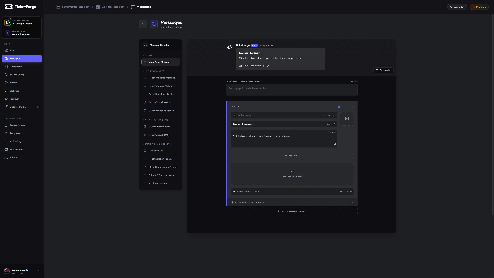

# Messages & Embeds

TicketForge allows you to fully customize the messages sent by the bot. You can create rich, professional **Embeds** with images, authors, and footers using the visual builder.

<figure markdown>
  { loading=lazy }
  <figcaption>The message editor screen.</figcaption>
</figure>

## Available Triggers

You can customize the message for every stage of the ticket lifecycle.

### Core Messages
| Trigger | Description |
| :--- | :--- |
| **Panel Message** | The public message users interact with to open a ticket. |
| **Welcome Message** | The first message sent inside a new ticket (pings user/staff). |
| **Ticket Controls** | The message attached to the buttons inside an open ticket. |

### Lifecycle Events
| Trigger | Description |
| :--- | :--- |
| **Ticket Claimed** | Sent when a staff member claims the ticket. |
| **Ticket Unclaimed** | Sent when a ticket is released back to the general pool. |
| **Ticket Closed** | Sent when a ticket is archived/closed (replaces controls). |
| **Ticket Reopened** | Sent if a staff member re-opens a closed ticket. |
| **Close Confirmation** | Displayed when "Two-Step Close" is active (asks "Are you sure?"). |
| **Delete Warning** | The final warning message sent 5 seconds before channel deletion. |

### Direct Messages (DMs)
| Trigger | Description |
| :--- | :--- |
| **DM: Created** | Sent to the user's DMs immediately after they open a ticket. |
| **DM: Closed** | Sent to the user's DMs when the ticket is closed by staff. |

### System & Notifications
| Trigger | Description |
| :--- | :--- |
| **Transcript Log** | The message posted in your Log Channel containing the file download. |
| **Support Closed** | Displayed if a user tries to open a ticket outside operational hours (if enabled). |