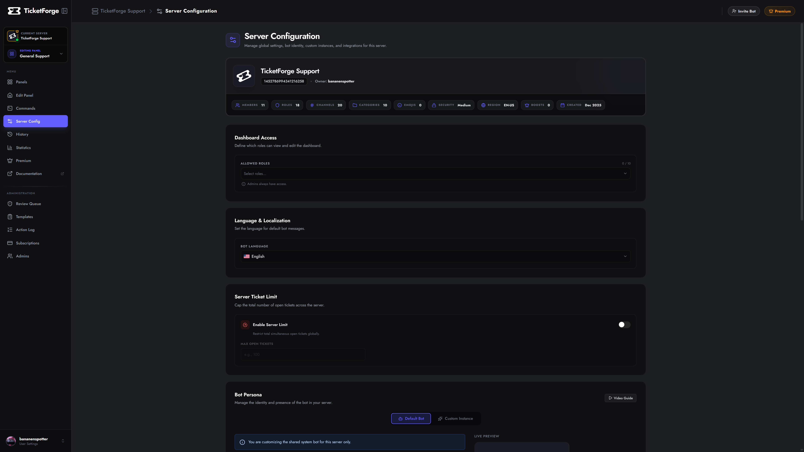

# Server Configuration

Manage global settings that apply to the entire bot within your server.

<figure markdown>
  { loading=lazy }
  <figcaption>Server Config settings.</figcaption>
</figure>

## Bot Persona

The **Bot Persona** section lets you customize how TicketForge appears in your server. There are two modes depending on your subscription plan.

### Standard Identity
*Premium Feature*

Included with the **Premium Plan**. Customize the bot's appearance within your server without replacing the bot application itself.

*   **Nickname:** Set a custom display name for the bot in your server's member list and messages.
*   **Avatar:** Upload a custom profile picture (PNG, JPG, or GIF, max 8MB) shown only in your server.
*   **Banner:** Upload a banner image displayed on the bot's profile card.
*   **Bio:** Set a custom "About Me" text visible when users click the bot's profile.

Leaving any of these fields blank reverts the bot to its global defaults.

---

### Custom Bot (Whitelabel)
*Support Plan Exclusive*

!!! warning "Support Plan Required"
    Running a full Custom Bot instance requires an active **Support Plan** subscription. It is not available on the Free, Trial, or Premium plans.

Take branding to the next level by running TicketForge under **your own bot application**. This fully replaces the "TicketForge" bot user with your own, giving you complete control over the username, avatar, and presence — the bot will appear as an entirely separate application in Discord.

-   :material-robot: **Standard Identity** *(Premium)*

    Customizes the bot's **Nickname**, **Avatar**, **Banner**, and **Bio** inside your server. The bot tag still shows the original TicketForge application name when clicked.

-   :material-incognito: **Full Custom Bot** *(Support Plan only)*

    Runs a dedicated instance using your own **Bot Token**. Completely replaces the bot identity — your own application name, profile picture, and presence. Requires an active **Support Plan**.

### Configuration
1.  Create a new application in the [Discord Developer Portal](https://discord.com/developers/applications).
2.  Enable all **Privileged Gateway Intents** under the Bot tab.
3.  Copy your **Bot Token** and paste it into the **Server Config > Custom Bot** section.
4.  TicketForge will spin up a dedicated instance for your server.

<!-- Video Section -->

    

        <iframe
            src="https://www.youtube.com/embed/9WBPmbWLx2Q"
            style="position: absolute; top: 0; left: 0; width: 100%; height: 100%;"
            frameborder="0"
            allow="accelerometer; autoplay; clipboard-write; encrypted-media; gyroscope; picture-in-picture"
            allowfullscreen>
        </iframe>
    

---

## Google Drive Integration
*Premium Feature*

Securely backup your transcripts to the cloud. By connecting your Google Drive, TicketForge will automatically upload HTML transcripts to a folder in your personal Drive whenever a ticket is saved.

1.  Go to **Server Config > Google Drive Transcripts**.
2.  Click **Connect Drive**.
3.  Authorize TicketForge to access your Drive files.

*   **Email:** Displays the connected Google account email.
*   **Security:** We use an encrypted Refresh Token system. We do not store your password.

---

## Dashboard Access
Control who can log in to the web dashboard to manage settings.

*   **Administrator:** Has full access by default.
*   **Custom Roles:** Select specific roles (e.g., "Head Mod") to grant them editor access.
    *   *Note:* Dashboard users can see all tickets and settings but cannot manage billing.

---

## Server Ticket Limit
Cap the total number of open tickets allowed across the entire server simultaneously.

*   **Enable Limit:** Toggles the restriction on or off.
*   **Max Open Tickets:** Set the numeric maximum (e.g., 50). Once this limit is reached, users attempting to open new tickets will receive an error message until a current ticket is closed.

---

## Language & Localization
Set the default language for bot system messages.

*   **Bot Language:** Select your preferred language from the dropdown (e.g., English, Deutsch, Français, Español, Nederlands). This affects error messages and system prompts sent by the bot.

---

## Interaction Blacklist
Prevent abuse by blocking specific roles from interacting with the bot entirely.

*   **Effect:** Users with a blacklisted role cannot click buttons, use dropdowns, or run slash commands.
*   **Usage:** Useful for "Muted" roles or punishing users who spam tickets.